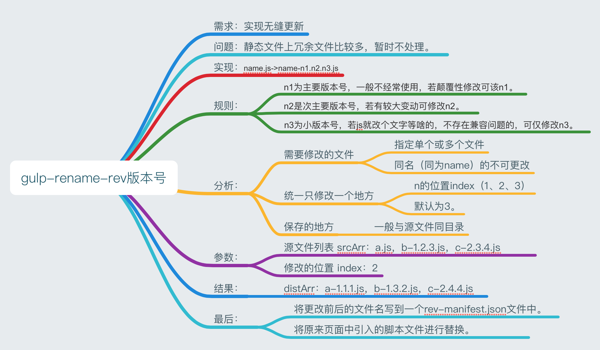

## gulp-rename-rev

基于gulp的插件，将按照一定的规则进行命名。为了满足公司业务需求，文件进行更名操作。 

- 实现：name.js->name-n1.n2.n3.js
-  规则：
  - n1为主要版本号，一般不经常使用，若颠覆性修改可该n1。
  - n2是次主要版本号，若有较大变动可修改n2。
  - n3为小版本号，若js就改个文字等啥的，不存在兼容问题的，可仅修改n3。

## Installation安装

```bash
npm i gulp-rename-rev --save-dev
```

## Usage用法

```js
var gulp = require('gulp');
var renameRev = require('gulp-rename-rev');

gulp.task('renameRev', () =>
    gulp.src('src/*.js')
        .pipe(renameRev(index))  //参数index=1、2、3,说明是第二个参数修改版本号。
        .pipe(gulp.dest('dist'))
        .pipe(renameRev.manifest())   //  这个步骤可以不用加，如果不加，则不生成配置文件。
        .pipe(gulp.dest('dist'))
);
```

## Example实例

```js
var gulp = require('gulp');
var renameRev = require('gulp-rename-rev');

gulp.task('renameRev', () =>
    gulp.src('src/*.js')
        .pipe(renameRev(2))  //2代表是第二个位置参数修改了，默认为3。
        .pipe(gulp.dest('dist'))
        .pipe(renameRev.manifest())
        .pipe(gulp.dest('dist'))
);
```

### before: scr/
```css
src/a.js
src/a-b-c.js
src/b-2.6.4.js
src/c-1.2.3.js
```

### after: dist/
```css
dist/a-1.1.1.js
dist/a-b-1.1.1.js
dist/b-2.7.4.js
dist/c-1.3.3.js
dist/rev-manifest.json
```
### after: rev-manifest.json

```html
{
  "a-b-c.js": "a-b-1.1.1.js",
  "a.js": "a-1.1.1.js",
  "b-2.6.4.js": "b-2.7.4.js",
  "c-1.2.3.js": "c-1.3.3.js"
}
```
## 思路



## 更新日志

- v1.0.3  提交gulp-rename-rev插件，之前提交有些问题错了。目前已修正。


> 主要参考：[gulp-rev](https://www.npmjs.com/package/gulp-rev) 来完成的。
